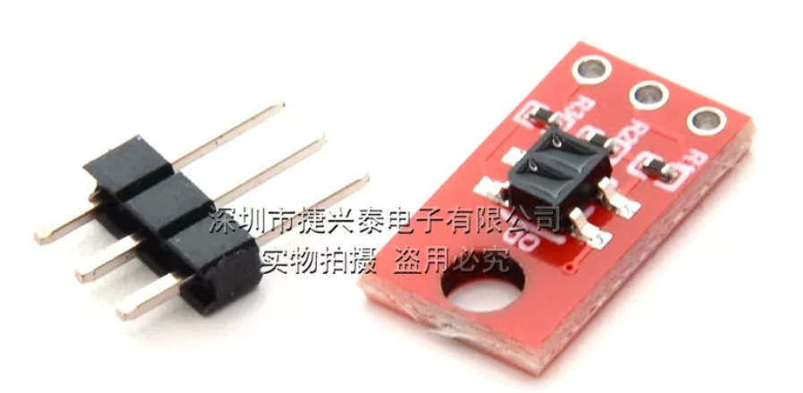
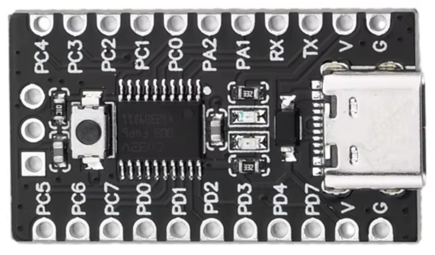
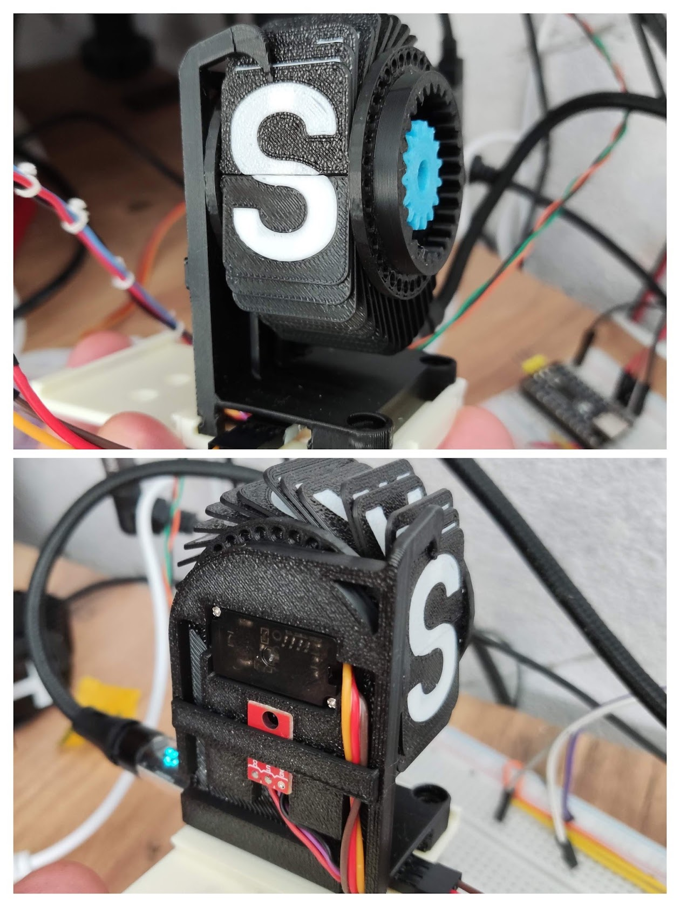
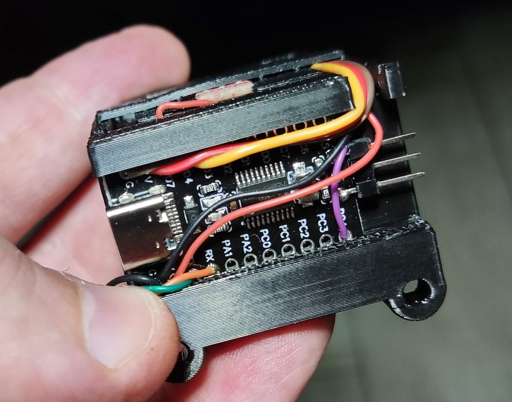
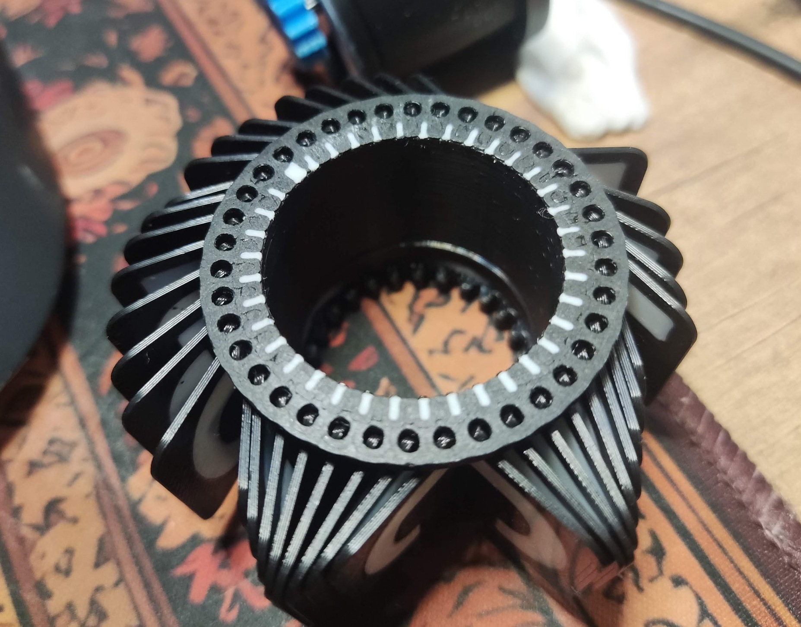
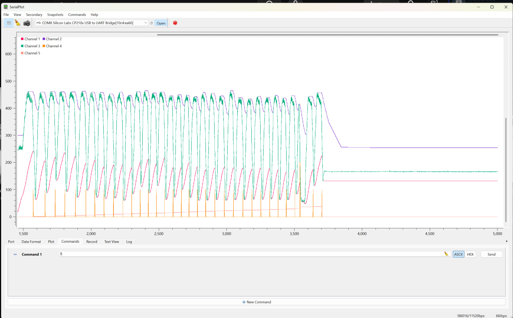

# Mini Split-Flap Display

Most current notes are in [doc/notes.txt](doc/notes.txt)

## Design goals

 * as compact as reasonably possible
 * full English alphabet and numbers, space and one extra character (38 flaps)
 * as cheap as reasonably possible, a bit janky is ok
 * 3D printable with minimal extra parts

The compact and cheap requirement limits the choice of motors to MG90S, or even SG90 micro servos. Steppers of similar size exist but they are a relative rarity and require a driver which costs more and takes space. Fortunately these motors can be bought in 360 degree variant.

## Approximate BOM

 * black and white PLA are mandatory for optical sensor contrast
 * QRE1113 sensor module (1 per module, ￥1.89/pc)  (modules may require changing LED resistor to 330 ohm!)
 * V1772 CH32V003F4P6 (1 per module, ￥2.86/pc) 
 * MG90S 360 degree servo (1 per module, ￥6.48/pc), SG90 360 degree can be used as well

## Design

See [printables](printables) and [CAD](printables/cad) for source files and detailed breakdown of every part.

The pictures tell everything. The motor is hidden inside the stator drum. Flappy drum sits on the stator driven by a little cog.

The wires are relatively neatly tucked away in cable channels carved for them in the main post, held captive together with the sensor board with a little snap-fit bracket.
The MCU board is hidden in the foot. Some careful wire soldering is required during assembly which takes quite a long time.

Because there are so many flaps in such a small place, precision positioning is important. The feedback is optical.
One of the sides of the flaps drum has embedded codewheel. Zero position is marked by a wider tick.

## Position sensing

Tracking reflective codewheel is not as trivial as I expected, sensor readout is far from ideal. Here's an example of what the readings look like:

The algorithm tracks min and max on raw data(green) independently (blue and red lines), then detects transitions over median line with added hysteresis.
High contrast here is very important. It's also important to print the code wheel side on a matte plate like Cool Plate SuperTack. Shiny tick marks read very poorly.

## Communications

Each wheel has independent controller (CH32V003). All together they are connected via I2C bus.

The master controller is Arduino Nano. In addition to requesting a letter display, the protocol supports setting I2C address and homing offset for every module.
