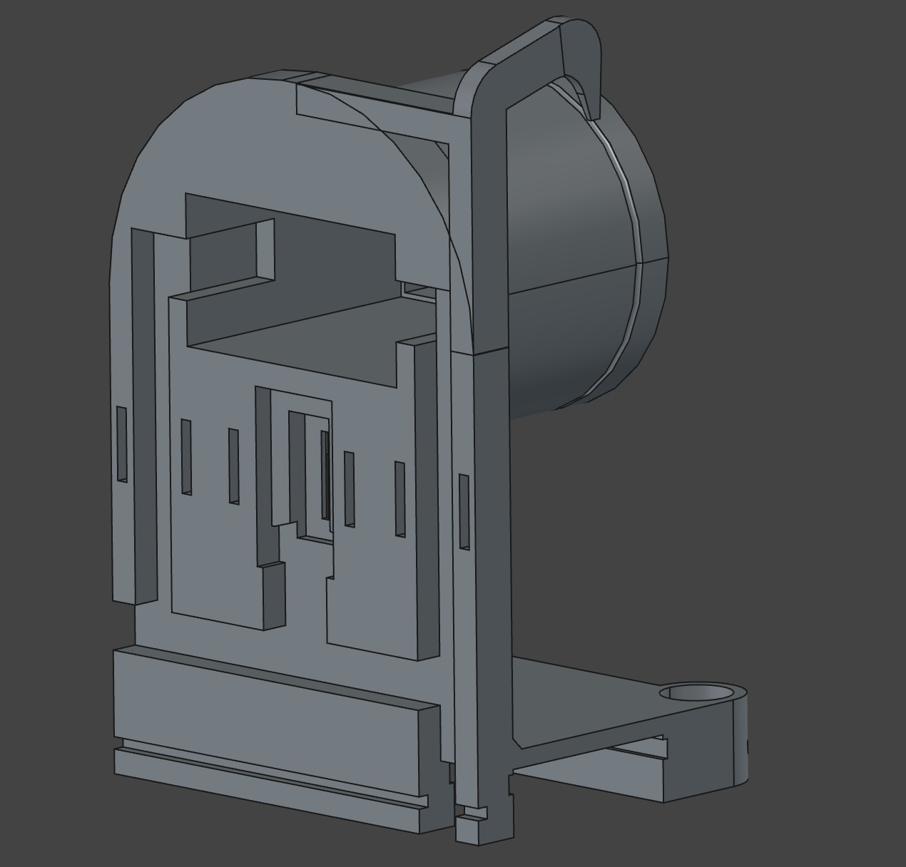
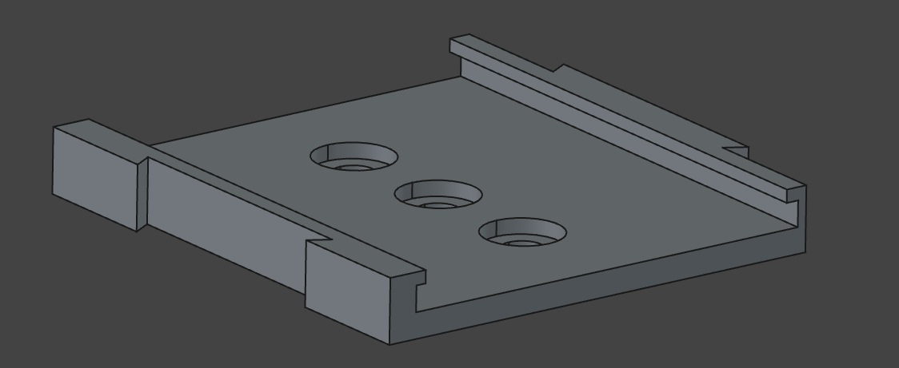
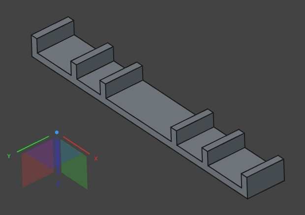
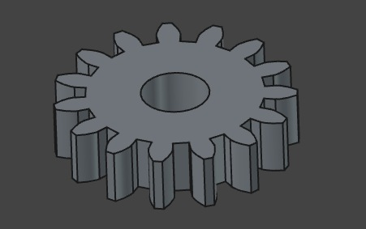
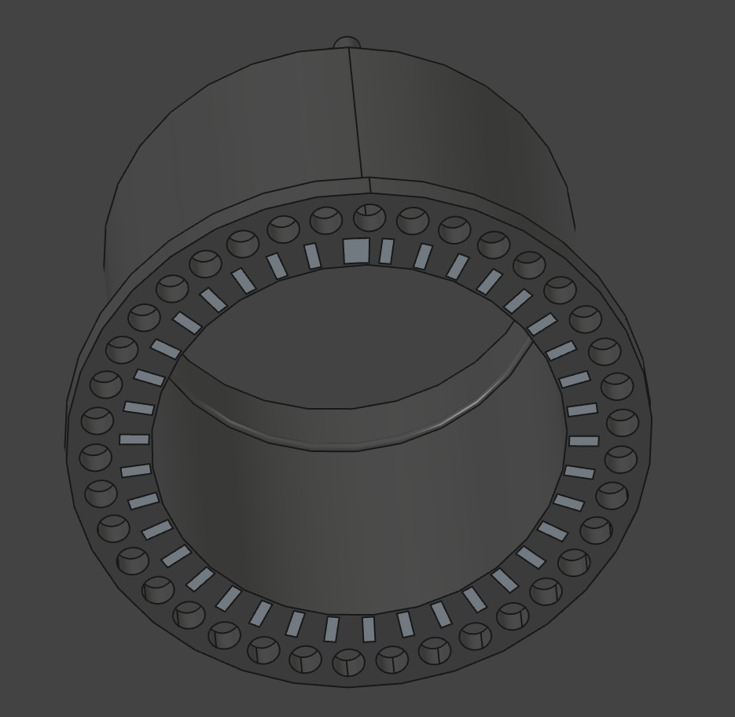
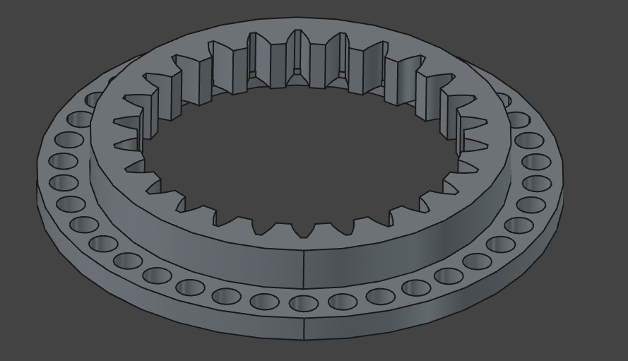
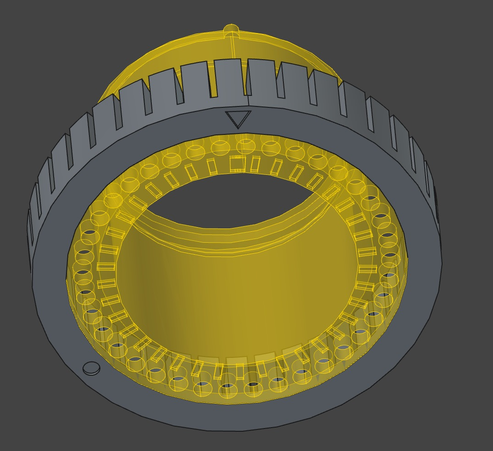
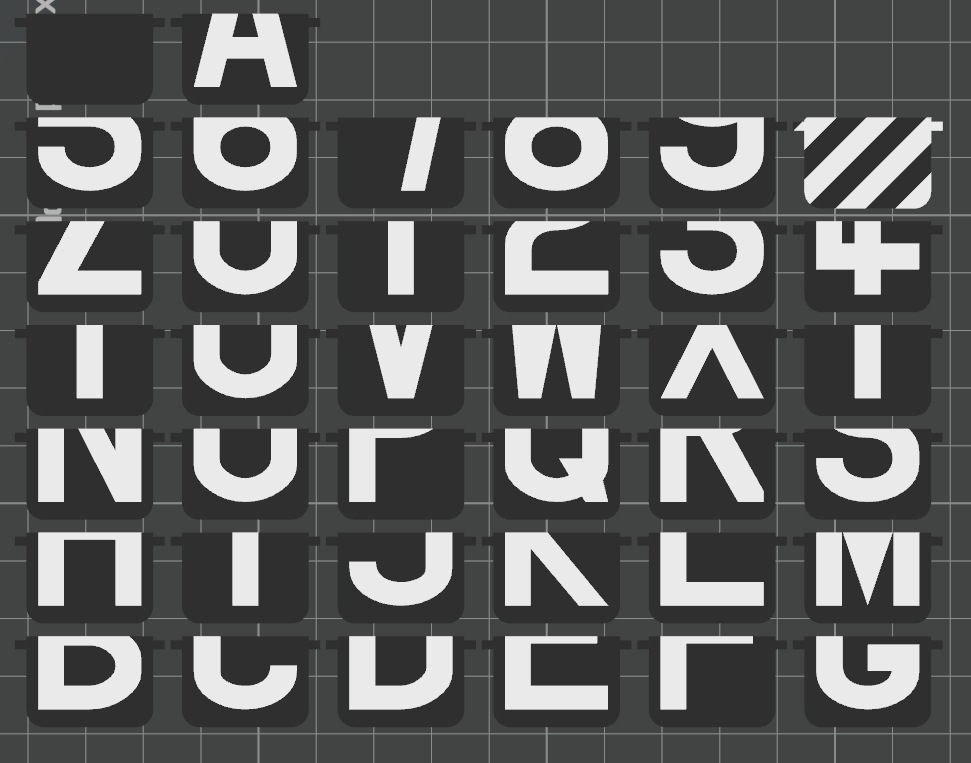

# CAD Files for Mini-Split-Flap Display

These files are a mess. I went through literally dozens of prototypes over multiple months with long breaks. 
I can't trace where the designs deviated. They should be merged into one but I don't know how to do it cleanly without breaking stuff.
So far there are just different CAD files. All current models also exist as .step and in one large .3mf project.

## [wheel-exp4-qre1113v3.FCStd](wheel-exp4-qre1113v3.FCStd) 

Stator 

[stator_with_dovetail3.step](step/stator_with_dovetail3.step)

Mounting rail

[rail.step](step/rail.step)

Snappy bracket (Body in StatorPart)

[snappy-bracket.step](step/snappy-bracket.step)

Pinion

Step file missing. Refer to .3mf.

## [wheel-exp6.FCStd](wheel-exp6.FCStd) 

Wheel + MarkersWhite

[wheel-axle-offset.step](step/wheel-axle-offset.step)

[wheel-axle-markers-offset.step](step/wheel-axle-markers-offset.step)

Wheel2 (gear side)

[wheel-gear.step](step/wheel-gear.step)

[gear-support.step](step/gear-support.step)

Assembly jig

Step file missing. See .3mf.

## [splitfap.scad](splitfap.scad) OpenSCAD model for the flaps

Step files missing. See .3mf.
